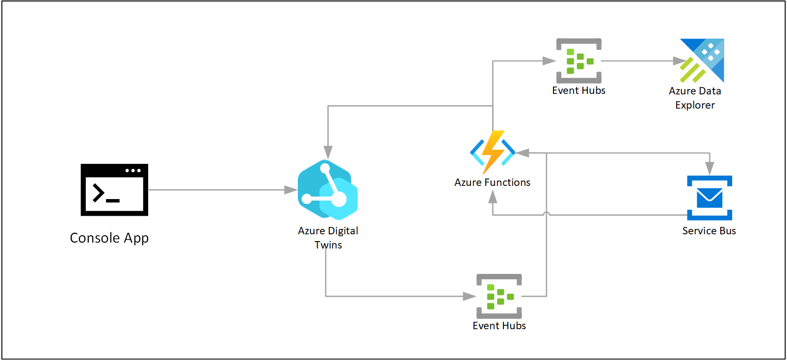

# Project Aqueduct - a sample Azure Digital Twins application

End-to-end sample application in process industry showcasing how to leverage Azure Digital Twins, a DTDL based ontology, and the right mix of Azure services to address key patterns.

> Disclaimer: this project is still in progress, and is meant as a learning exercise. It does not contain official guidance on using Azure Digital Twins.

If you are interested in quickly experimenting and deploying the sample setup, continue on. If you would like to read more about this experiment you can find more detailed documentation:
- [Project Aqueduct background and overview](docs/README.md)
- [DTDL Models](docs/dtdl.md)
- [Azure Digital Twins routing and event propagation flows](docs/routing.md)
- [Historization and running queries with Azure Data Explorer and Azure Digital Twins plugin](docs/adtqueryhist.md)
- Deployment scripts


> Further in this repo we abbreviate the following words: **ADT**: Azure Digital Twins;  **DTDL**: Digital Twins Definition Language.

### Architecture components



### Graph in Azure Digital Twins Explorer


## Open points

- Finalize documentation
- Add more examples of ADT queries
- Add Azure Data Explorer dashboards

## Deployment

The repo contains deployment scripts for the full solution (execute from the `./deploy` folder).

### Pre-requisites
- Azure account
- Azure CLI
- .NET Core 5
- Visual Studio Code
- Azure Functions Tools

### Deploy

1. Deploy Azure Resources, by default this deploys into West Europe region. Change the region by using the parameter `-l`:

    `./deploy-azure.sh -p aqueduct`

2. Deploy Azure Function

    From Visual Studio Code: Azure Functions: Deploy to Function App (which has been created with the above script, you will find it by looking for a fuction prefixed with the above prefix)

3. Deploy Azure Digital Twins models: note the parameter `-n` must match the name of the newly deployed Azure Digital Twins instance. Validate before executing:

    `/deploy-models.sh -n aqueductadt -c -f ../models`

4. Deploy twins: the default script deploys a sample process of a water flow starting with a reservoir and ending up in two points of use. 

    `./deploy-twins.sh -n aqueductadt`


## Testing

The repo contains a simulator for testing the solution (see `src/SimulateData` project).
To run the console app locally, update the appsettings.json file with the URL of your Azure Digital Twins service created by the deployment scripts. Or create your local `appsettings.local.json` file with the following structure:

```json
{
    "ADT":
    {
        "ADT_URI": "https://[YOUR_ADT_URL]"
    }
}
```

