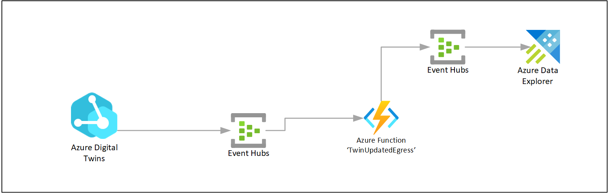

# Historization and running queries with Azure Data Explorer and Azure Digital Twins plugin

## How ADT twin property updates are being historized in Azure Data Explorer

As we want to capture every single Property update within the ADT and store it in the time series databased in ADX, we setup a 'Route' in ADT called `twin-history` to listen to all events filtered on `type = 'Microsoft.DigitalTwins.Twin.Update'`, and push them into a new Event Hub.  
From there an Azure Function `TwinUpdatedEgress` does some transformation and generates a new Event Hub message. 
Azure Data Explorer is setup to have Event Hub streaming ingestion which ingests the raw data into the table `rawAdtHistory`. From there all processing is internal to ADX. Notably we parse the raw data into a new streamlined table `AdtHistory`. This is the actual table we leverage to query across ADT and ADX.

> Note: you could do a more simplified setup above by eleminating both the Azure Function and the second Event Hub, but there is a reason we kept it. We want to add some logic of how the updates are generated and we want to control the 'TimeStamp' property: when the update comes from a Device twin, we don't want to take the DT's event generated time, but rather the property `SensorTimestamp` and use that as the TimeStamp.



## Querying ADT and ADX

With the Azure Digital Twins query plugin for Azure Data Explorer, you can query the knowledge graph from within ADX and combine the result with time series data for exploration and dashboarding.

> More information about the plugin: [Azure Digital Twins query plugin for Azure Data Explorer](https://docs.microsoft.com/en-us/azure/digital-twins/concepts-data-explorer-plugin)

Below you can find a few examples of queries that allow for finding insights.
Make sure to update the `[ADT_URI]` to match your instance of ADT.

1. Query all twin IDs and join them to the data in ADX:

    ```
    let ADTendpoint = "[ADT_URI]";
	let ADTquery = "SELECT $dtId as tid from DIGITALTWINS"; 
	evaluate azure_digital_twins_query_request(ADTendpoint, ADTquery) 
	| extend Id = tostring(tid)
	| join kind=inner (AdtHistory) on Id 
    | order by TimeStamp desc
    ```
2. Query all Assets (twins based on a model of type 'dtmi:sample:aqueduct:asset:Base;1', or inheriting from) that are at two hops away from Operator1

    ```
    let ADTendpoint = "[ADT_URI]";
	let ADTquery = "SELECT asset.$dtId as tid from DIGITALTWINS MATCH (operator)-[*2]-(asset) WHERE IS_OF_MODEL(asset, 'dtmi:sample:aqueduct:asset:Base;1') AND operator.$dtId = 'Operator1'"; 
	evaluate azure_digital_twins_query_request(ADTendpoint, ADTquery) 
	| extend Id = tostring(tid)
	| join kind=inner (AdtHistory) on Id 
    ```
3. Now extend this query to start playing with the data in ADX. In this example we select only a specific property `FlowVolume`, do a value conversaion for the field `Value` which is of type dynamic, and then use a grouping and chart

    ```
    let ADTendpoint = "[ADT_URI]";
	let ADTquery = "SELECT asset.$dtId as tid from DIGITALTWINS MATCH (operator)-[*2]-(asset) WHERE IS_OF_MODEL(asset, 'dtmi:sample:aqueduct:asset:Base;1') AND operator.$dtId = 'Operator1'"; 
	evaluate azure_digital_twins_query_request(ADTendpoint, ADTquery) 
	| extend Id = tostring(tid)
	| join kind=inner (AdtHistory) on Id 
    ```

For more information on ADT queries: [Azure Digital Twins query language](https://docs.microsoft.com/en-us/azure/digital-twins/concepts-query-language).


