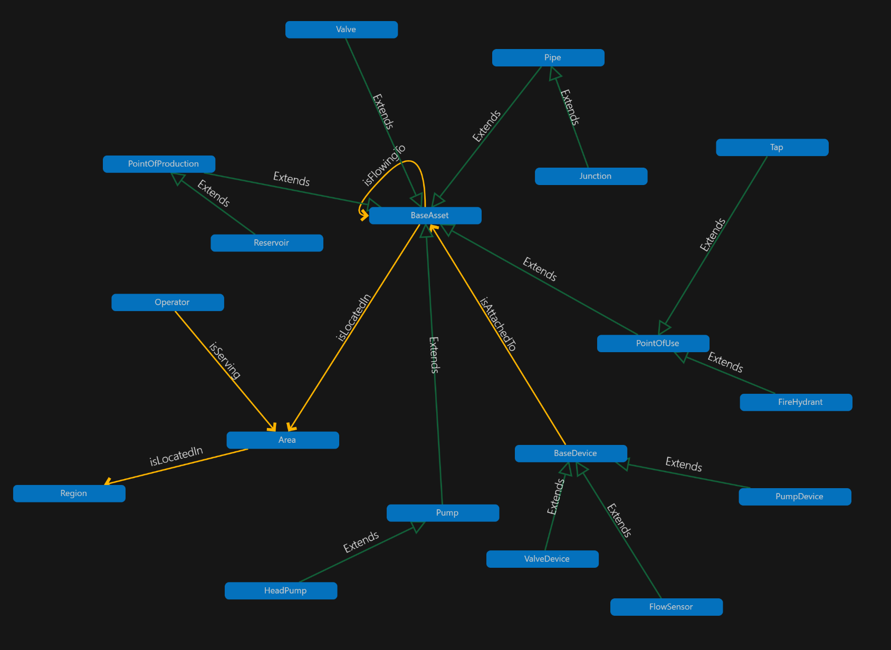

# DTDL Models

You can find the DTDL models in the folder `/models`. 

We have decided to use a naming convention for our Base models like `dtmi:sample:aqueduct:device:Base;1` for alls Device types of models, and `dtmi:sample:aqueduct:asset:Base;1` for all models of type asset. While this is not required for inheritance, the reasoning behind it was experimenting with ADT service and using the 'Routes' feature.



Based on these DTDL models, the deployment scripts create a graph with a representation of a simplified water distribution system. Going from a point of origin to the final points of use.


## DTDL details

### Main models and base models

There are five big groups of models:
- *Area*: this is a geographic/political area that allows for connecting several relations of the type `isLocatedIn`, which will then allow us to query the graph and select potential zones of impact for problems or operators within an area.
- *Region*: aggregates multiple araeas.
- *Operator*: is serving one or multiple areas, and by linking assets to areas we can identify which operators to alert in case of issues occuring on the system.
- *Asset*: we use a Base model to create a set of properties and relationships that can be inherited by all types of assets. Notably a relationship `isFlowingTo` whic allow any asset to flow in a specific direction into any other asset. Models inheriting from the Base asset model are Valve, Pipe, PointOfUse, PointOfProduction, and futher down inheriting from some of these are Reservoir, Tap, etc.
- *Device*: any device model inherits from a base device model, which has a number of based properties like VolumeFlow, Temperature, and more. Models of the type device are ValveDevice, FlowSensor and PumpDevice. Some of the models have added custom properties like a ValveDevice has a property of 'OpenStatus', which a PumpDevice does not have.

### Semantic types

Whenever possible, we leveraged the pre-defined semantic types in DTDL, so that subsequent programming with the ADT graph would allow us to infer that for example Temperature is actually stored as Degrees Celsius, or VolumeFLow is expressed in *litrePerSecond*.

```
{
      "@type": [
        "Property",
        "VolumeFlowRate"
      ],
      "name": "FlowVolume",
      "schema": "double",
      "unit": "litrePerSecond",
      "comment": "Current flow volume in litres per second"
    },
```

Read more about Semantic types [here](https://github.com/Azure/opendigitaltwins-dtdl/blob/master/DTDL/v2/dtdlv2.md#semantic-types).

### Enums

Enums in DTDL are data types with preset named labels that map to values. Read more about Enums [here](https://github.com/Azure/opendigitaltwins-dtdl/blob/master/DTDL/v2/dtdlv2.md#enum).

In our Aqueduct model, we leverage Enums to represent things like quality of a certain asset, like this:

```
  {
  "@type": "Property",
      "name": "PressureQuality",
      "schema": {
        "@type": "Enum",
        "valueSchema": "integer",
        "enumValues": [
          {
            "name": "unknown",
            "displayName": "Unknown",
            "enumValue": 0,
            "description": "Pressure condition is unknown"
          },
          {
            "name": "under",
            "displayName": "Under",
            "enumValue": 1,
            "description": "Pressure is below lowest value (below 0)"
          },
          {
            "name": "no",
            "displayName": "No",
            "enumValue": 2,
            "description": "There is no pressure (at 0)"
          },
          {
            "name": "low",
            "displayName": "Low",
            "enumValue": 3,
            "description": "Pressure is at low value (between 0 and Margin)"
          },
          {
            "name": "normal",
            "displayName": "Normal",
            "enumValue": 4,
            "description": "Pressure is normal (between Margin and Capacity-Margin)"
          },
          {
            "name": "high",
            "displayName": "High",
            "enumValue": 5,
            "description": "Pressure is at high value (between Capacity-Margin and Capacity)"
          },
          {
            "name": "max",
            "displayName": "Max",
            "enumValue": 6,
            "description": "Pressure is at maximum value (at Capacity)"
          },
          {
            "name": "over",
            "displayName": "Over",
            "enumValue": 7,
            "description": "Pressure is above maximum value (above Capacity)"
          }
        ]
      },
      "comment": "Condition of pressure"
    }
```

These properties will be updated through event propagation via Azure Functions.

### Storing value and storing limits within the model

One of the things we also reflected on was the usecase of having both values of temperatures, volume flows and so forth propagate through the model, but also having actual properties to set limits or expected values. Consider these as properties that don't upgrade very often, but can be used to add some 'intelligence' to the twin by having more dynamic limit properties.

Consider properties like *ExpectedFlowVolume* or *PressureMargin* in the model `dtmi:sample:aqueduct:asset:Base;1`. These properties will not be updated by using data from a device but rather we see these as settings, potentially updated by operators through an administrative UI. 
We will use such properties to allow us to dynamically calculate other types of properties such as *PressureQuality*.

```
    {
      "@type": [
        "Property",
        "Pressure"
      ],
      "name": "PressureVolume",
      "schema": "double",
      "unit": "bar",
      "comment": "Current pressure volume in bar"
    },
    {
      "@type": [
        "Property",
        "Pressure"
      ],
      "name": "PressureMargin",
      "schema": "double",
      "unit": "bar",
      "comment": "Expected margin between maximum pressure capacity and current pressure volume in bar"
    }
    ...
```


