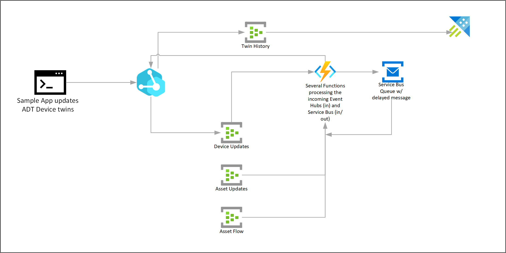

# Azure Digital Twins routing and event propagation flows

At the heart of our learning experiment was understanding how we could leverage [ADT Routing](https://docs.microsoft.com/en-us/azure/digital-twins/concepts-route-events#create-an-event-route) to egress events based on certain filters, as well as use external compute through Azure Functions to update the model in an ongoing fashion as data is fed into the devices layer.

High level flow:

## Azure Digital Twins Routes

The following ADT routes are used in the solution:
- **Device Updates**
    - ADT Event Hub endpoint: `device-updates`
    - ADT event route: `device-updates`
    - ADT event route filter: `type='Microsoft.DigitalTwins.Twin.Update' AND STARTS_WITH($body.modelId, 'dtmi:sample:aqueduct:device:')`
    - Azure Function: [`DeviceUpdated`](../src/cloud/functions/DeviceUpdated.cs)
    - This route will process twin property changes on devices. For every property change on a device, the same property on the attached (using relation `isAttachedTo`) asset will also be updated. Additionally the `FlowCondition` will be set (is the flow within the configured range).

- **Asset Updates**
    - ADT Event Hub endpoint: `asset-updates`
    - ADT event route: `asset-updates`
    - ADT event route filter: `type='Microsoft.DigitalTwins.Twin.Update' AND STARTS_WITH($body.modelId, 'dtmi:sample:aqueduct:asset:')`
    - Azure Function: [`AssetUpdated`](../src/cloud/functions/AssetUpdated.cs)
    - This route will process twin property changes on assets. For every property change on an asset, the `OperationalStatus` of the area and region where the asset is located (using relation `isLocatedIn`) will be calculated and set.

- **Asset Flow**
    - ADT Event Hub endpoint: `asset-flow`
    - ADT event route: `asset-flow`
    - ADT event route filter: `type='Microsoft.DigitalTwins.Twin.Update' AND STARTS_WITH($body.modelId, 'dtmi:sample:aqueduct:asset:')`
    - Azure Function: [`AssetFlow`](../src/cloud/functions/AssetFlow.cs)
    - This route will process use twin property changes on assets to simulate the flow through the modelled system by calculating the `ExpectedFlowVolume` for each connected asset based on the asset type and configuration, see [below](#flow-simulation) for a description.
<!-- 
- **Twin History**
    - ADT Event Hub endpoint: `twin-history`
    - ADT event route: `twin-history`
    - ADT event route filter: `type = 'Microsoft.DigitalTwins.Twin.Update' OR type = 'Microsoft.DigitalTwins.Relationship.Update'`
    - Azure Function: [`TwinUpdatedEgress`](../src/cloud/functions/TwinUpdatedEgress.cs)
    - This route will process twin property changes. Every property change will be stored in a table of the attached Azure Data Explorer instance. For the timestamp of the change, the `SensorTimestamp` property (if exists this is the timestamp of the source) will be used, otherwise the time stamp of the twin change. -->

We use the following DTDL model naming convention: all device models start with `dtmi:sample:aqueduct:device` and all asset models start with `dtmi:sample:aqueduct:asset`. While this is not required for inheritance, it makes it possible to do ADT event route filtering on base type.

## Flow condition

All assets in the model have a `FlowVolume` property (current flow volume in litres per second) and some flow configuration properties (`FlowCapacity` for the maximum flow capacity in litres per second, and `FlowMargin` for expected margin between maximum flow capacity and current flow volume in litres per second). The `FlowCondition` is calculated from the current flow volume and the flow configuration properties using the following mapping.

| Flow volume                     | Condition |
| ------------------------------- | --------- |
| < -0.1                          | under     |
| -0.1 .. 0.5                     | no        |
| 0.5 .. margin                   | low       |
| margin .. capacity-margin       | normal    |
| capacity-margin .. capacity-0.5 | high      |
| capacity-0.5 .. capacity+0.1    | max       |
| > capacity+0.1                  | over      |

## Flow simulation {#flow-simulation}

All assets in the model have a `FlowVolume` property and an `ExpectedFlowVolume` property. The `FlowVolume` property contains the current flow volume of the asset and can be updated by a connected device. The `ExpectedFlowVolume` is a calculated value for assets that  do not update the `FlowVolume` themselves.

The `ExpectedFlowVolume` for each connected (using relation `isFlowingTo`) asset is calculated based on the current asset type and its configuration.

- Pipe
    - To simulate flow time (liters per second) the time needed to flow through the pipe is calculated (from the `Length` and `Diameter` properties).
    - The function `UpdateAssetTwinAfter` will send a twin patch as a [scheduled message](https://docs.microsoft.com/en-us/azure/service-bus-messaging/message-sequencing#scheduled-messages) to the ServiceBus queue `twin-updates` (using method `ScheduleMessageAsync`).
    - The Azure Function [`DelayedTwinUpdates`](../src/cloud/functions/DelayedTwinUpdates.cs) is processing these scheduled messages, and patches the properties of the twin (in this case update the `ExpectedFlowVolume` of the asset).

- Junction
    - The function `GetFlowingToAssetsCapacity` will get all connected (using relation `isFlowingTo`) assets and their `FlowCapacity`.
    - The current `FlowVolume` will be split proportionally over all connected assets by setting their `ExpectedFlowVolume` property.

- Valve
    - If the valve is open (based on the value of the `OpenStatus` property) the `ExpectedFlowVolume` of the connected asset will be set to the `FlowVolume` of the current asset.

