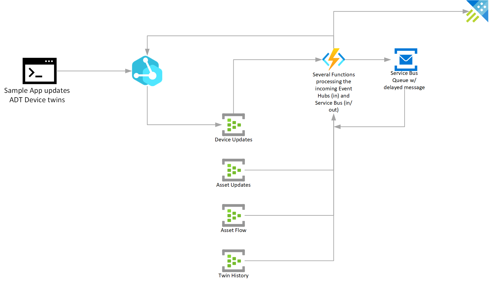

# Azure Digital Twins routing and event propagation flows

At the heart of our learning experiment was understanding how we could leverage ADT routing to egress events based on certain filters, as well as use external compute through Azure Functions to update the model in an ongoing fashion as data is fed into the devices layer.

High level flow:

